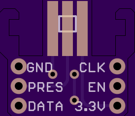

# Nunchuck Breakout
A breakout board for the Wii Nunchuck

## Version History

| Revision # | Schematic | Board | BOM | Top | Bottom |  Purchase Link | Notes |
| ------ | ------ | ------ | ------ | ------ | ------ | ------ |
| 0 | N/A | N/A | N/A | N/A | N/A | N/A | Initial Version. No locking mechanism. Produced on a PCB mill @ college. Works |
| 1 | N/A | N/A | N/A | N/A | N/A | N/A | New version with locking mechanism and built to straddle a solderless breakout board |
| 2 | N/A | N/A | N/A | N/A | N/A | N/A | Similar to Rev 1. Now contains alignment square to help show which way the Nunchuck should be plugged in |
| 3 | N/A | N/A | N/A | N/A | N/A | N/A | Added `enable` pin for enabling/disabling the nunchuck so multiple can be used |
| 4 | [SCH](source/Rev4.sch), [PDF](schematics/Rev4.sch.pdf) | [BRD](source/Rev4.brd), [PDF](boards/Rev4.brd.pdf) | N/A | [PNG](renderings/Rev4.top.png) | [PNG](renderings/Rev4.bot.png) | [OSHPark ($2.00)](https://oshpark.com/projects/nHR9gFSK) | Added hopefully stronger locking section. |

